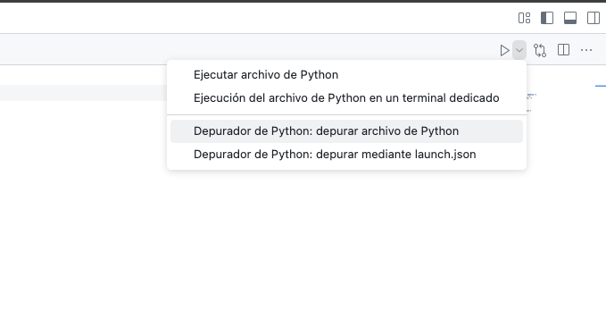
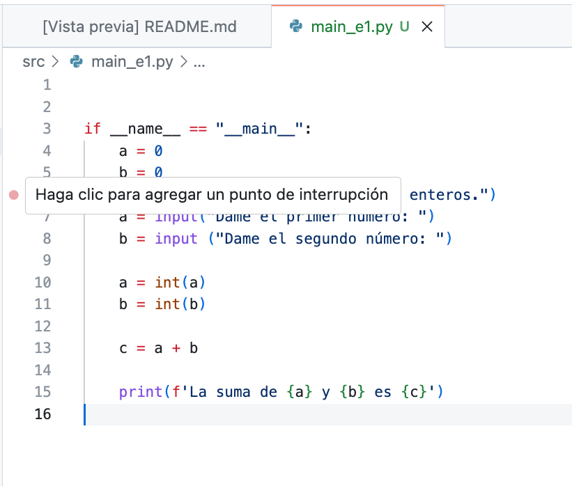
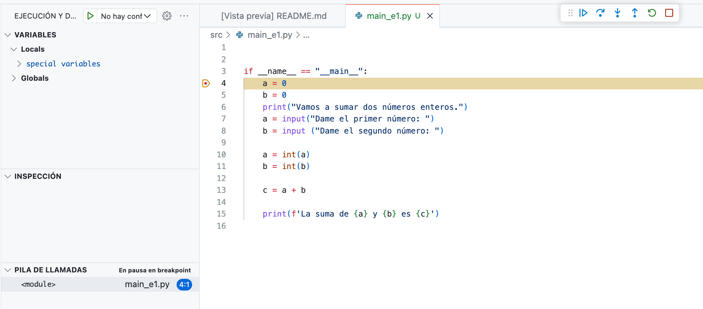
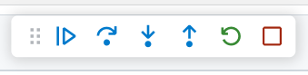
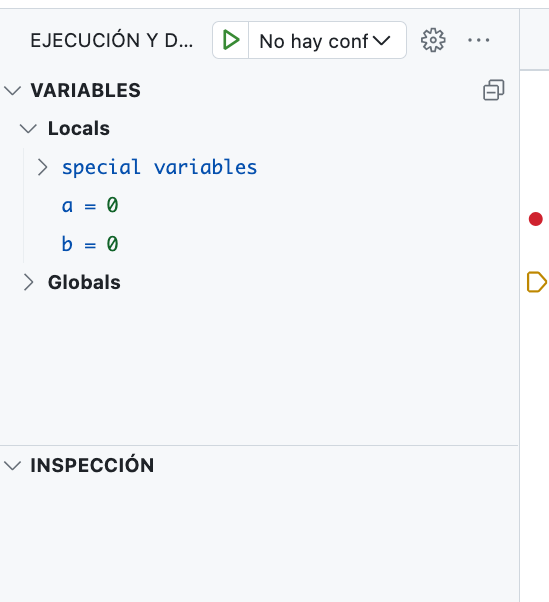

# LAB 0 - Introducción al entorno de desarrollo y debugging en Python.


Ya hemos visto como poner a punto nuestro entorno de programación con GitHub Classroom, si aún tienes alguna duda recuerda que están todos los pasos en [este repositorio.](https://github.com/usc-gria/programacionII-instructions)

En esta primera práctica vamos a aprender a inspeccionar nuestro código haciendo debugging. Si le preguntamos a nuestro amigo ChatGPT nos dirá que `el debugging es el proceso de identificar, analizar y corregir errores o fallos en el código de un programa para que funcione correctamente y cumpla con los objetivos esperados.` Es decir, será una herramienta que nos permita identificar y corregir errores que tengamos en nuestro código. Es una herramienta muy útil que cualquier persona que tenga que trabajar con código usa diariamente. 

Las herramienta de IDE (Integrated Development Environment) disponen de funcionalidades específicas para ayuda a la depuración de programas. Dichas funcionalidades permiten realizar, entre otras, las siguientes tareas:
- Ejecución paso a paso del programa
- Evaluación de los valores de las variables, listas, etc …
- Establecimiento de puntos de detención temporal del flujo del programa

Vamos a hacer una serie de ejercicios para que te vayas haciendo a la herramienta. Abrimos nuestro GitHub Codespaces y nos vamos al archivo `scr/main_e1.py` que suma dos numeros que le demos por entrada. Seguramente tengamos que instalar de nuevo Python.

```python
if __name__ == "__main__":
    a = 0
    b = 0
    print("Vamos a sumar dos números enteros.")
    a = input("Dame el primer número: ")
    b = input ("Dame el segundo número: ")

    a = int(a)
    b = int(b)

    c = a + b

    print(f'La suma de {a} y {b} es {c}')
```

## Lanzar el modo debugging en VSCode

Para acivar el modo depuración tenemos que hacer click arriba a la derecha en la flecha hacia abajo al lado del símbolo de ejecución (►) y seleccionar donde pone `Depurador de Python: Depurar archivo de Python`. Ten en cuenta que en Visual Studio Code esta acción quedará guardada por defecto para la siguiente ejecución, fíjate que ahora en vez del símbolo de ejecutar (►) aparece el mismo pero con una especie de escarabajo (🐞▶️). El escarabajo es el símbolo por defecto para representar bug o error en el código. Si quieres cambiar a una ejecución normal deberás hacer click en el menú desplegable de antes y seleccionar `Ejecutar archivo de Python`. 

<p align="center">
  
</p>


## Breakpoints: parando nuestro código

Si lazamos este proceso, veremos que no pasa absolutamente nada y el programa se ejecutar de forma normal. Como queremos debuggear (inspeccionar) nuestro código, tenemos que indicar en el IDE dónde queremos que se pare esta ejecución. Para ello, vamos a utilizar los `breakpoints` o `puntos de interrupción`. Para marcar un punto de parada acercamos nuestro ratón a la parte izquierda del editor de código, justo antes de el número de línea, y veremos que aparece un punto rojo (🔴)

<p align="center">
  
</p>

Vamos a fijar un punto de interrupción en la primera tarea de nuestro código (línea 4) y ejecutamos de nuevo el proceso de debugging. Nos saldrá una ventana como la que se muestra a continuación.

<p align="center">
  
</p>

A partir de aquí podemos decidir como se irá ejecutando el código. La forma más habitual es paso a paso, ejecutando cada sentencia individualmente. Esto se puede hacer en el siguiente menú:

<p align="center">
  
</p>

1. El primer botón reanuda la ejecución del programa hasta que encuentra otro punto de interrupción. 
2. El segundo realiza una ejecución línea a línea sin entrar en las llamadas a funciones (Step Over). 
3. El tercero también realiza una ejecución línea a línea, pero entra en el código de las funciones que se utilizan (Step Into). 
4. La flecha hacia arriba permite navegar hacía atrás en la pila de llamadas. 
5. Los dos últimos botones permiten reiniciar y parar la depuración respectivamente.


#### Ejercicio 1.1
Vamos a ir pulsando el segundo botón (Step Over) y veremos como se irá iluminando en amarillo dónde se encuentra parada nuestra ejecución. Ten en cuenta que el programa seguirá funcionando igual en las lineas 7 y 8 donde pedimos los números al usuario. Hasta que no los introduzcamos, no volverá a aparecer el panel de manejo de secuencias. 


## Visualización de los valores de las variables

La ejecución paso a paso de un programa es una herramienta útil en la depuración cuando se combina con la visualización del valor de las diferentes variables declaradas en el mismo. Esto permite ir siguiendo las diferentes operaciones (aritméticas, lógicas, asignaciones) del programa, lo que facilita la detección de los errores.

La herramienta de visualización de variables de VS Code se encuentra en la parte superior del panel izquierdo. En el ejemplo anterior, vemos el estado de las variables del programa antes del primer print (linea 6).

<p align="center">
  
</p>


#### Ejercicio 1.2
-------------------
Ejecuta el programa y cubre la siguiente tabla con los valores de cada variable antes de la ejecución de la línea correspondinte. 

| Linea    | a   | b   | c   |    
|:--------:|:---:|:---:|:---:|
| Linea 4  |     |     |     |
| Linea 5  |     |     |     |    
| Linea 7  |     |     |     |  
| Linea 8  |     |     |     |  
| Linea 10 |     |     |     |  
| Linea 11 |     |     |     |  
| Linea 13 |     |     |     |  


#### Ejercicio 2

Utiliza el debugging para analizar el código de `src/main_e2.py`, busca los errores y corrígelos. Existen un total de 9 errores a solucionar. Además, responde a las siguientes preguntas:

1. ¿Qué instrucciones estaban mal y por qué?

2. ¿Qué instrucciones has añadido para substituir los errores?

3. ¿Qué pasa con las variables del main cuando transicionamos hacia una función?


Sube los cambios a tu repositorio, ya que revisaré si has solucionado los errores ;). Algunos comentarios:

- No cambies el nombre de ninguna función ni sus parámetros de entrada
- Gestiona la existencia de los productos en la lista correctamente devolviendo `None` si no existe.
- Si un producto ya existe, no debería agregarse de nuevo.